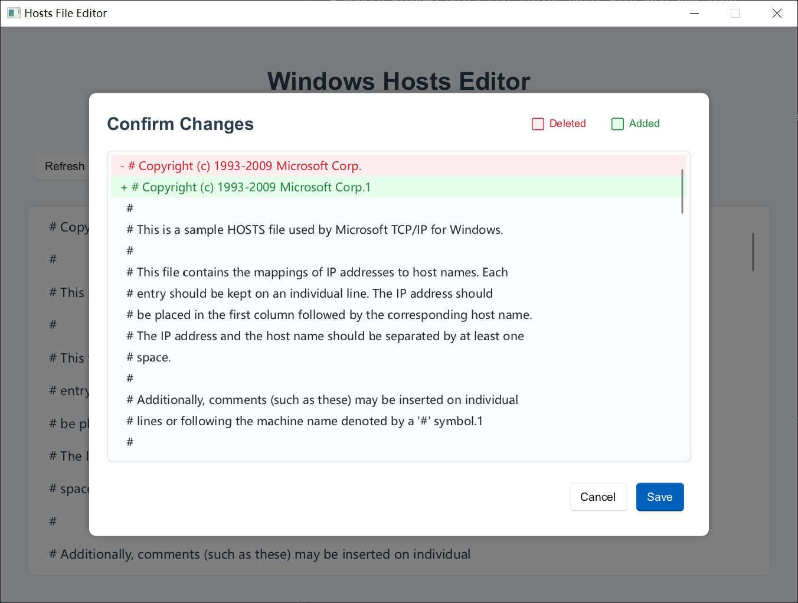

# Windows Hosts File Editor

A modern Windows Hosts file editor built with Rust and Slint.



## Features

- Direct in-app editing with scrollable text area
- Save confirmation dialog with diff preview (deleted lines in red, added lines in green)
- Auto-detect file encoding (UTF-8 / GBK)
- Clean, modern UI

## Requirements

- Windows OS
- Rust toolchain
- Administrator privileges (required to modify hosts file)

## Build

```bash
cargo build --release
```

## Run

The hosts file requires admin rights to modify. Use one of these methods:

```bash
# Using batch file
.\run_release.bat

# Or PowerShell
Start-Process "target\release\hosts-editor.exe" -Verb RunAs

# Or right-click the exe → "Run as administrator"
```

## Usage

1. Launch with admin privileges - hosts file loads automatically
2. Edit directly in the text area
3. Click "Save" to preview changes and confirm
4. Click "Refresh" to reload the file

## Tech Stack

- Rust
- Slint 1.8
- similar (diff library)
- encoding_rs (encoding detection)

## License

MIT
